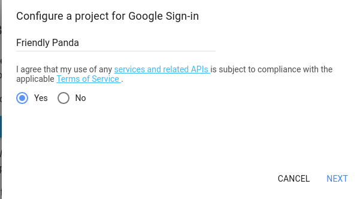
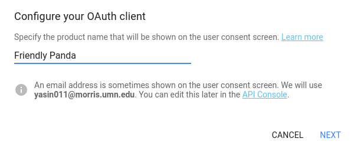
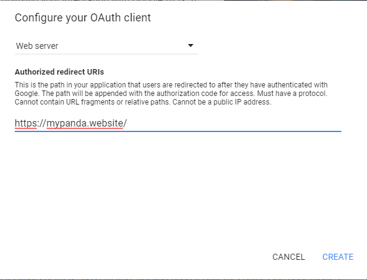
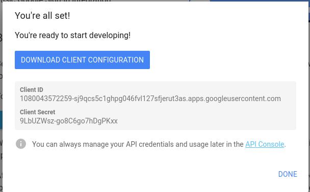
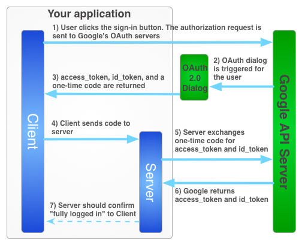

# Setting up Google Login for Friendly Panda:


## First Step:
#### Create a Google API console project and Client ID:

Do this by going to https://developers.google.com/identity/sign-in/web/sign-in

Before you can integrate Google Sign-In into your website, you must create a client ID, which you need to call the sign-in API.



When you press next you will get to be here:



## Second Step:
The next tab asks you if you want to set this up for a Chrome App, or a web browser or web server or Ios App etc. You should choose web server because you would like to set up login always on the server side. Thinking way down the road you will realize that it’s way much safer and efficient to do so. If you do client side login, you’re thinking about getting all your database from the server and then use google’s user information to do filtering on the client side to show only information that match your user details. This is risky and not safe as you don’t want to get all user databases into the client side, rather using server side login where only matching data to your server only comes through is the safer and efficient way to go.



Your authorized redirect URIs is very important and should be set to where you’re going to be running this. One might try to create two different OAuth Client, one for the localhost and one for the actual IP address.
**So, when you’re working on login and not deploying set your Authorized redirect URIs to be:**

**http://localhost:9000/**

Based on either localhost or you’re IP address, You will get your own set of Client ID and Client Secret.



*You can always change things on your API Console!*

Also, Download the JSON file cause that's what we are going to store later rather than hard coding stuff.

##### Important: ClientID is needed in 3 places: index.html, app.component.ts, and in client_secret_file.json


To use Google services on behalf of a user when the user is offline, you must use a hybrid server-side flow where a user authorizes your app on the client side using the JavaScript API client and you send a special one-time authorization code to your server. Your server exchanges this one-time-use code to acquire its own access and refresh tokens from Google for the server to be able to make its own API calls, which can be done while the user is offline. This one-time code flow has security advantages over both a pure server-side flow and over sending access tokens to your server. 

##### Important: The Google Sign-In server-side flow differs from the OAuth 2.0 for Web server applications flow. 

The sign-in flow for obtaining an access token for your server-side application is illustrated below. 



One-time codes have several security advantages. With codes, Google provides tokens directly to your server without any intermediaries.

***Keep your client secret secret!***


**THE NEXT STEP IS ALL BASED ON:** 
https://developers.google.com/identity/sign-in/web/server-side-flow

## Third Step:

### Include the Google platform library on your page
Include the following scripts that demonstrate an anonymous function that inserts a script into the DOM of this index.html web page.

```
<!-- The top of file index.html -->

<html itemscope itemtype="http://schema.org/Article">
<head>
  <!-- BEGIN Pre-requisites →
  <script src="//ajax.googleapis.com/ajax/libs/jquery/1.8.2/jquery.min.js">
 </script>
  <script src="https://apis.google.com/js/client:platform.js?onload=start" async defer>
  </script>
  <!-- END Pre-requisites -->
```
### Initialize the GoogleAuth object
Load the auth2 library and call gapi.auth2.init() to initialize the GoogleAuth object. Specify your client ID and the scopes you want to request when you call init().
```
<!-- Continuing the <head> section →
<script>
    function start() {
     gapi.load('auth2', function() {
       auth2 = gapi.auth2.init({
         client_id: 'YOUR_CLIENT_ID.apps.googleusercontent.com',
         // Scopes to request in addition to 'profile' and 'email'
          //scope: 'additional_scope'
        });
     });
   }|
 </script>
</head>
<body>  <!-- ... --></body></html>
```
### Add the sign-in button to your page
Add the sign-in button to your web page, and attach a click handler to call grantOfflineAccess() to start the one-time-code flow.

```
<div *ngIf="!appService.isSignedIn()" class="g-signin2" (click)="signIn()"></div>
```
Use a script like this to handle sending code to the server
```
<script>
  $('#signinButton').click(function() {
   // signInCallback defined in step 6.
    auth2.grantOfflineAccess().then(signInCallback);
 });
</script>
```

### Send the authorization code to the server
The code is your one-time code that your server can exchange for its own access token and refresh token. You can only obtain a refresh token after the user has been presented an authorization dialog requesting offline access. You must store the refresh token that you retrieve for later use because subsequent exchanges will return null for the refresh token. This flow provides increased security over your standard OAuth 2.0 flow.

Access tokens are always returned with the exchange of a valid authorization code.

The following script defines a [callback](https://developers.google.com/identity/#button_attr_callback) function for the sign-in button. When a sign-in is successful, the function stores the access token for client-side use and sends the one-time code to your server on the same domain.

```
<!-- Last part of BODY element in file index.html -->

<script>
function signInCallback(authResult) {
 if (authResult['code']) {
// Hide the sign-in button now that the user is authorized, for example:
    $('#signinButton').attr('style', 'display: none');

    // Send the code to the server
$.ajax({
     type: 'POST',
     url: 'http://example.com/storeauthcode',|
     // Always include an `X-Requested-With` header in every AJAX request,
      // to protect against CSRF attacks.
      headers: {
       'X-Requested-With': 'XMLHttpRequest'
      },
     contentType: 'application/octet-stream; charset=utf-8',
     success: function(result) {
       // Handle or verify the server response.
      },      processData: false,
data: authResult['code']
   });
 } else {
   // There was an error.
  }}
</script>
```

### Exchange the authorization code for an access token
On the server, exchange the auth code for access and refresh tokens. Use the access token to call Google APIs on behalf of the user and, optionally, store the refresh token to acquire a new access token when the access token expires.

If you requested profile access, you also get an ID token that contains basic profile information for the user.

For example:
```
// (Receive authCode via HTTPS POST)
if (request.getHeader('X-Requested-With') == null) {
 // Without the `X-Requested-With` header, this request could be forged. Aborts.} // Set path to the Web application client_secret_*.json file you downloaded from the // Google API Console:
https://console.developers.google.com/apis/credentials
// You can also find your Web application client ID and client secret from the // console and specify them directly when you create the GoogleAuthorizationCodeTokenRequest // object.

String CLIENT_SECRET_FILE = "/path/to/client_secret.json";
// Exchange auth code for access token
GoogleClientSecrets clientSecrets =
   GoogleClientSecrets.load(
       JacksonFactory.getDefaultInstance(), new
FileReader(CLIENT_SECRET_FILE));
GoogleTokenResponse tokenResponse =
         new GoogleAuthorizationCodeTokenRequest(
new NetHttpTransport(),
             JacksonFactory.getDefaultInstance(),              "https://www.googleapis.com/oauth2/v4/token",
clientSecrets.getDetails().getClientId(),
             clientSecrets.getDetails().getClientSecret(),
             authCode,

              REDIRECT_URI)  

// Specify the same redirect URI that you use with your web                             // app. If you don't have a web version of your app, you can                // specify an empty string.
         .execute();
String accessToken = tokenResponse.getAccessToken();
// Use access token to call API

GoogleCredential credential = new GoogleCredential().setAccessToken(accessToken);

Drive drive =

    new Drive.Builder(new NetHttpTransport(), JacksonFactory.getDefaultInstance(), credential)

        .setApplicationName("Auth Code Exchange Demo")

        .build();

File file = drive.files().get("appfolder").execute();

// Get profile info from ID token

GoogleIdToken idToken = tokenResponse.parseIdToken();
GoogleIdToken.Payload payload = idToken.getPayload();
String userId = payload.getSubject(); 
// Use this value as a key to identify a user.
String email = payload.getEmail();
boolean emailVerified = Boolean.valueOf(payload.getEmailVerified());
String name = (String) payload.get("name");
String pictureUrl = (String) payload.get("picture");
String locale = (String) payload.get("locale");
String familyName = (String) payload.get("family_name");
String givenName = (String) payload.get("given_name");
```

## Fourth Step:
Then use specific ID tokens to make a new collection. For instance, we chose the getSubject which is unique to each user to link up to all our different collection.

Our user collection in the database consisted of 4 different fields:

User Collection:
_id = MongoDB based auto generated unique object ID
subjectID = The one we import from the Gapi Client
(String userId = payload.getSubject)
FirstName = User Given name from the Gapi Client
LastName = User Last name from the Gapi client

We then used filtering on all the different collections in the server controller and handler through adding one more field to the collection which is userID. 

UserID is basically the _id objectID we gave that was generated from the subjectID we imported from the Gapi Client.

We do this in the server java file:
This is the code that makes the import and adds those variables from Gapi client into the Usercontroller for the UserCollection

```
JSONObject obj = new JSONObject(req.body());
String authCode = obj.getString("code");

try {

   // We can create this later to keep our secret safe

   String CLIENT_SECRET_FILE = "./src/main/java/umm3601/server_files/client_secret_file.json"; 
```
You can hide your json file and then call it out like this^
```
   GoogleClientSecrets clientSecrets =

      GoogleClientSecrets.load(

           JacksonFactory.getDefaultInstance(), new FileReader(CLIENT_SECRET_FILE));

   GoogleTokenResponse tokenResponse =

       new GoogleAuthorizationCodeTokenRequest(

           new NetHttpTransport(),

           JacksonFactory.getDefaultInstance(),

           "https://www.googleapis.com/oauth2/v4/token",

           clientSecrets.getDetails().getClientId(),

           // Replace clientSecret with the localhost one if testing

           clientSecrets.getDetails().getClientSecret(),

           authCode,

           "http://localhost:9000")

           //Not sure if we have a redirectUri

           // Specify the same redirect URI that you use with your web

           // app. If you don't have a web version of your app, you can

           // specify an empty string.

           .execute();

   GoogleIdToken idToken = tokenResponse.parseIdToken();

   GoogleIdToken.Payload payload = idToken.getPayload();

   String subjectId = payload.getSubject();  // Use this value as a key to identify a user.

   String email = payload.getEmail();

   boolean emailVerified = Boolean.valueOf(payload.getEmailVerified());

   String name = (String) payload.get("name");

   String pictureUrl = (String) payload.get("picture");

   String locale = (String) payload.get("locale");

   String familyName = (String) payload.get("family_name");

   String givenName = (String) payload.get("given_name");

   return userController.addNewUser(subjectId, givenName, familyName);
```


We filter through our given generated _id/UserID rather than the subjectID in all of the other collection for an extra layer of protection. Now the Client side will only consists of collections with an object ID which is unique to the app and not give out Google Subject ID to hack other form of data.

For instance,

Journaling Collection:

$oid(for that specific journal), title, body, date and userID(from user collection)

Goals Collection:

$oid(for that specific goal), purpose, category, name, status, start, end, next, frequency and userID(from user collection)


Emotions Collection:

$oid(for that specific Emotion), mood, intensity, date and userID (from user collection)  


##### References:
https://developers.google.com/identity/sign-in/web/server-side-flow

https://developers.google.com/identity/sign-in/web/backend-auth

https://developers.google.com/identity/sign-in/web/people


##### For more questions contact @xaivteev, @CMenne, @ahnafy

